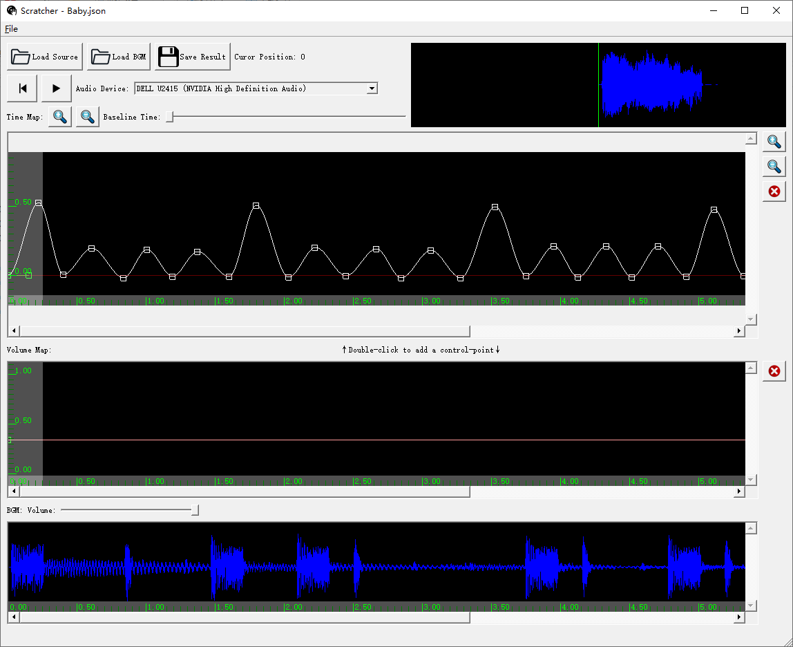

# Scratcher



Scratcher is a dedicated sound-effect generator simulating the [DJ Scratching](https://en.wikipedia.org/wiki/Scratching) technique.

The sound-effect is generated by editing 2 curves using the UI provided by the software.

The first curve is a time-map. It controls the back and forth movement of the audio sample being scratched. 

The second curve controls the volume of the sound effect.

A control points can be added to a curve by a double-click, and can be edited by dragging. The time-map curve is a Cubic Hermite Spline (C1 continuous). Therefore, a slope value can be set for each control-point in addition to its position, where a value 0 is most common. The volume curve is simpler. It is piecewise linear (C0 continuous).

Optionally, the sound-effect can be mixed with a BGM in real time.

DJ Scratching resources can be found on internet, for example:
[https://soundsozai.com/dj-scratch-samples/](https://soundsozai.com/dj-scratch-samples/)


## Binary Releases

[https://github.com/fynv/Scratcher/releases/](https://github.com/fynv/Scratcher/releases/)

## Building from Source-code

### Download Dependencies

* Qt5

For Windows:

[https://www.qt.io/download](https://www.qt.io/download)

For Linux:

Install qt5-default using the system package manager, for example:

```
$ sudo apt install qt5-default
```

* FFMpeg 4.3

For Windows:

A prebuilt package can be found at [https://www.gyan.dev/ffmpeg/builds/](https://www.gyan.dev/ffmpeg/builds/).

For Linux:

Install ffmpeg and libavformat-dev using the system package manager, for example:
```
$ sudo add-apt-repository ppa:jonathonf/ffmpeg-4
$ sudo apt update
$ sudo apt install ffmpeg
$ sudo apt install libavformat-dev
```

### Clone the repository
```
git clone https://github.com/fynv/Scratcher.git
```

### Create a "build" folder and build with CMake

For Windows, the variables "FFMPEG_ROOT" and "QT_ROOT" need to be set according to where the dependencies are installed. For Linux, these are not needed if the dependencies are installed to system locations (/usr/ for example).

After "make install", the binary can be found in the "bin" folder.


